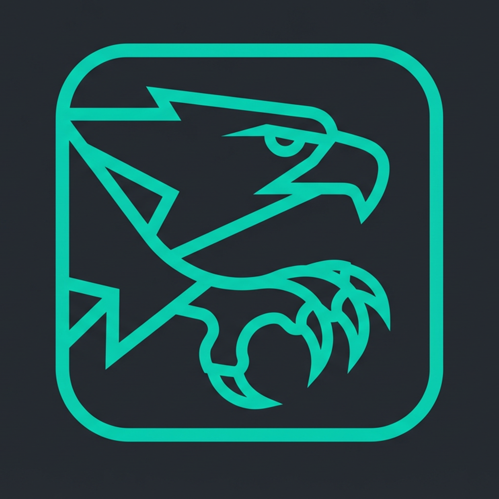

<div align="center">
  
  <h1>🦅 HyperClaw</h1>
  <p><strong>Your personal AI assistant — running on your hardware, talking on your channels.</strong></p>
  <p><em>One command to install. Works on Telegram, Discord, WhatsApp, Signal, iMessage and 25+ more.</em></p>
</div>

<p align="center">
  <a href="https://github.com/mylo-2001/hyperclaw/stargazers"></a>
  <a href="https://github.com/mylo-2001/hyperclaw/network/members"></a>
  <a href="https://www.npmjs.com/package/hyperclaw"></a>
  <a href="https://www.npmjs.com/package/hyperclaw"></a>
  <a href="https://github.com/mylo-2001/hyperclaw/actions"></a>
  
  
  
  
</p>

<p align="center">
  <a href="docs/README.md">📚 Docs</a> ·
  <a href="docs/architecture.md">🏗 Architecture</a> ·
  <a href="docs/configuration.md">⚙️ Config</a> ·
  <a href="docs/security.md">🔒 Security</a> ·
  <a href="docs/sandboxing.md">🐳 Sandboxing</a> ·
  <a href="docs/tlon.md">🌊 Tlon</a> ·
  <a href="docs/google-chat.md">💬 Google Chat</a> ·
  <a href="CONTRIBUTING.md">🤝 Contributing</a>
</p>

---

> **"One `npm install -g hyperclaw` and your AI is live on Telegram."**

---

## Why HyperClaw?

| Feature | HyperClaw | Cloud assistants | Self-hosted alternatives |
|---------|:---------:|:----------------:|:------------------------:|
| Runs on your own hardware | ✅ | ❌ | ✅ |
| No subscription / pay-per-token only | ✅ | ❌ | ✅ |
| 28+ messaging channels built-in | ✅ | ❌ | ⚠️ few |
| Windows native (no WSL) | ✅ | — | ❌ |
| Config hot-reload (no restart) | ✅ | — | ❌ |
| Built-in security audit (`--fix`) | ✅ | — | ❌ |
| DM pairing / allowlist by default | ✅ | — | ⚠️ manual |
| Voice (TTS + STT) | ✅ | ✅ | ⚠️ |
| Docker sandbox for agent tools | ✅ | — | ⚠️ |
| MCP (Model Context Protocol) | ✅ | ⚠️ | ⚠️ |
| One-command wizard (`hyperclaw onboard`) | ✅ | — | ❌ |
| OSINT / Ethical hacking mode (`hyperclaw osint`) | ✅ | ❌ | ❌ |

---

## Use cases

| Use case | How |
|----------|-----|
| **Personal assistant** | Chat via Telegram/Discord, voice on macOS/iOS, always-on daemon |
| **Bug bounty & OSINT** | HackerOne/Bugcrowd/Synack API keys, web-search skill, clipboard & screenshot tools |
| **Ethical hacking / pentest** | PC access tools (bash, file read/write), sandboxed execution, MCP tool servers |
| **Cybersecurity research** | Automate recon, triage findings, draft reports — all from your phone via Telegram |
| **Developer productivity** | Code review, GitHub integration, local shell access, memory across sessions |
| **Home automation** | Cron skills, morning briefing, calendar events, device commands (macOS/Android) |

> HyperClaw runs **locally on your machine** — your data, your keys, your control.

---

## 🚀 Get started in 60 seconds

**Requires Node ≥ 22.** Runs natively on Windows, macOS, and Linux — no WSL2 required.

```bash
# Install
npm install -g hyperclaw@latest

# Run the interactive setup wizard
hyperclaw onboard
# Run the interactive setup wizard with deamon
hyperclaw onboard --install-daemon
```

The wizard walks you through: AI provider → model → channels → skills. Done.

```bash
# After setup, start your assistant
hyperclaw daemon start

# Send a test message
hyperclaw agent --message "What can you do?"

# Health check
hyperclaw doctor
```

> **Windows**: No WSL2, no admin rights needed. The daemon uses Task Scheduler and runs as your account.

<details>
<summary>More install options</summary>

```bash
# pnpm
pnpm add -g hyperclaw@latest

# Install with daemon (auto-start on boot + full PC access)
hyperclaw onboard --install-daemon

# Uninstall
hyperclaw daemon uninstall
npm uninstall -g hyperclaw
rm -rf ~/.hyperclaw   # optional — removes config and data
```

</details>

---

## Channels

HyperClaw connects to the channels you already use (28+ channels):

| Channel | Status | Notes |
|---------|--------|-------|
| ✈️ Telegram | ✅ Recommended | Bot API via @BotFather |
| 🎮 Discord | ✅ Recommended | discord.js — full bot |
| 🌐 WebChat | ✅ Built-in | Gateway WebSocket, no setup |
| 🖥️ CLI / Terminal | ✅ Built-in | `hyperclaw agent` |
| 📲 WhatsApp (Baileys) | ✅ Available | No Meta API — scan QR |
| 📱 WhatsApp (Cloud API) | ✅ Available | Meta Business API |
| 💼 Slack | ✅ Available | Bolt — Events API |
| 🔒 Signal | ✅ Available | Requires signal-cli |
| 💬 iMessage | ✅ Available (macOS) | Via BlueBubbles |
| 🔷 Matrix | ✅ Available | matrix-js-sdk |
| 📡 IRC | ✅ Available | libera.chat etc. |
| 🏢 Mattermost | ✅ Available | PAT + outgoing webhook |
| 🔵 Google Chat | ✅ Available | Incoming webhook |
| 🟣 Microsoft Teams | ✅ Available | Incoming webhook |
| ⚡ Nostr | ✅ Available | Decentralized |
| 🟩 LINE | ✅ Available | LINE Messaging API |
| 🪶 Feishu / Lark | ✅ Available | Enterprise messaging |
| 📷 Instagram DMs | ✅ Available | Meta Business API |
| 💬 Facebook Messenger | ✅ Available | Meta Business API |
| 🐦 Twitter / X DMs | ✅ Available | X API v2 |
| 🟣 Viber | ✅ Available | Viber Bot API |
| ☁️ Nextcloud Talk | ✅ Available | Self-hosted |
| 🔵 Zalo | ✅ Available | Zalo Official Account |
| 🔵 Zalo Personal | ✅ Available | Unofficial / cookie-based |
| 📧 Email | ✅ Available | SMTP + IMAP |
| 🎙️ Voice Call | ✅ Available | Terminal voice session |
| 🌐 Chrome Extension | ✅ Available | Browser sidebar |
| 🌊 Tlon (Urbit Groups) | ✅ Available | Decentralized — see [docs/tlon.md](docs/tlon.md) |

Twitch is also available via IRC over WebSocket.

Add a channel:

```bash
hyperclaw channels add telegram
```

---

## Architecture

```
WhatsApp / Telegram / Slack / Discord / Signal / iMessage
Google Chat / Matrix / IRC / Mattermost / Teams / Nostr / WebChat
               │
               ▼
┌──────────────────────────────────┐
│           HyperClaw Gateway      │
│        ws://127.0.0.1:18789      │
│  sessions · auth · routing       │
│  tools · cron · webhooks         │
└──────────────┬───────────────────┘
               │
       ┌───────┼───────┐
       ▼       ▼       ▼
   Agent     CLI     Nodes
  (Claude,  (hyperclaw  (macOS/iOS/
  OpenRouter  …)       Android)
  OpenAI…)
```

---

## Providers

HyperClaw supports any OpenAI-compatible API and Anthropic natively:

| Provider | IDs |
|----------|-----|
| **Anthropic** | `anthropic` — Claude 4 Opus/Sonnet/Haiku |
| **OpenRouter** | `openrouter` — 200+ models |
| **OpenAI** | `openai` — GPT-4o, GPT-4.1 |
| **xAI** | `xai` — Grok |
| **Groq** | `groq` — Llama, Mixtral (fast) |
| **Custom** | `custom` — any OpenAI-compatible endpoint |

---

## Configuration

Minimal `~/.hyperclaw/hyperclaw.json`:

```json
{
  "provider": {
    "providerId": "anthropic",
    "modelId": "claude-sonnet-4-6",
    "apiKey": "sk-ant-..."
  },
  "gateway": {
    "port": 18789
  }
}
```

Or use OpenRouter (access to all models with one key):

```json
{
  "provider": {
    "providerId": "openrouter",
    "modelId": "anthropic/claude-opus-4-6",
    "apiKey": "sk-or-..."
  }
}
```

Full reference: [docs/configuration.md](docs/configuration.md)

### Config hot reload

The gateway watches `~/.hyperclaw/hyperclaw.json` and applies changes automatically — no restart needed for most settings:

```json
{
  "gateway": {
    "reload": { "mode": "hybrid", "debounceMs": 300 }
  }
}
```

| Mode | Behavior |
|------|----------|
| `hybrid` _(default)_ | Hot-applies safe changes, auto-restarts for critical ones |
| `hot` | Hot-applies only — warns when a restart is needed |
| `restart` | Restarts on any change |
| `off` | Disables file watching |

### Reverse proxy / trustedProxies

If you run behind Nginx, Caddy, or Cloudflare Tunnel, set `trustedProxies` so the gateway resolves the real client IP from `X-Forwarded-For`:

```json
{
  "gateway": {
    "trustedProxies": ["127.0.0.1", "10.0.0.0/8"]
  }
}
```

### DM scope isolation

Isolate DM sessions per channel/peer (useful when multiple people share one gateway):

```json
{
  "session": { "dmScope": "per-channel-peer" }
}
```

---

## Security defaults

HyperClaw connects to real messaging surfaces. Inbound DMs are treated as untrusted input.

**Default behavior:**

- `dmPolicy: "pairing"` — unknown senders get a pairing code, message is not processed.
  Approve with: `hyperclaw pairing approve telegram <CODE>`
- Set `dmPolicy: "open"` only if you want anyone to reach your assistant.
- Non-main sessions (groups/channels) can run in Docker sandboxes: `agents.defaults.sandbox.mode: "non-main"`

Run the security audit regularly:

```bash
hyperclaw security audit           # standard scan
hyperclaw security audit --deep    # live gateway probe
hyperclaw security audit --fix     # auto-fix safe issues
hyperclaw security audit --json    # machine-readable output
```

Full guide: [docs/security.md](docs/security.md)

---

## Features

- **Local-first Gateway** — single control plane for sessions, channels, tools, and events
- **Config hot reload** — gateway watches `~/.hyperclaw/hyperclaw.json`, hot-applies changes (hybrid/hot/restart/off)
- **Multi-channel inbox** — 28+ channels, unified session model
- **Multi-agent routing** — route channels/accounts to isolated agent workspaces
- **Extended thinking** — Claude extended thinking with `/think high` in chat
- **Voice** — Talk Mode with ElevenLabs TTS + system TTS fallback
- **Live Canvas** — agent-driven visual workspace with A2UI protocol
- **PC Access** — bash, file read/write, screenshot, clipboard (opt-in, sandboxed)
- **Tool policy** — per-provider allow/deny lists and profiles (`full`, `coding`, `messaging`, `minimal`)
- **Auto-memory** — extracts facts from conversations automatically
- **Skills** — bundled and workspace skills (reminders, translator, web search, etc.)
- **Daemon mode** — launchd/systemd user service, auto-restart, `🩸` icon
- **MCP support** — Model Context Protocol server and client
- **Docker** — sandboxed agent execution, browser tools with Puppeteer
- **Tailscale** — Serve/Funnel for remote access without port forwarding

---

## Apps (optional)

The Gateway alone delivers a great experience. Apps add extra features:

### macOS menu bar (optional)

- Menu bar control + health indicator
- Voice Wake + Push-to-Talk overlay
- WebChat + debug tools
- Remote gateway control

### iOS node (optional)

- Pairs over Gateway WebSocket (Bonjour discovery + manual)
- Canvas surface + Voice
- Camera and screen capture tools

### Android node (optional)

- Connect/Chat/Voice tabs + Canvas
- Camera, screen capture, device commands
- Notifications, contacts, calendar, photos

---

## Chat commands

Send these in any connected channel (Telegram, Discord, Slack, etc.):

| Command | Description |
|---------|-------------|
| `/status` | Session status (model, tokens, cost) |
| `/new` or `/reset` | Reset the session |
| `/compact` | Compact context (auto-summary) |
| `/think <level>` | `off` · `low` · `medium` · `high` · `xhigh` |
| `/verbose on\|off` | Verbose mode |
| `/usage off\|tokens\|full` | Per-response usage footer |

## HyperClaw Bot commands

Control the gateway remotely via your Telegram or Discord bot (`hyperclaw bot start`):

| Command | Description |
|---------|-------------|
| `/status` | Gateway + daemon status |
| `/restart` | Restart the gateway |
| `/logs [n]` | Last N log lines (default 20) |
| `/channels` | List configured channels |
| `/approve <ch> <code>` | Approve a DM pairing code |
| `/hook list` | List all hooks |
| `/hook on <id>` | Enable a hook |
| `/hook off <id>` | Disable a hook |
| `/agent <msg>` | Send a message to the AI agent |
| `/activation` | Show current group activation mode |
| `/activation mention` | Bot responds only to @mentions and replies _(default)_ |
| `/activation always` | Bot responds to all messages in a group |
| `/security` | Security audit summary |
| `/help` | List all commands |

## Agent-to-Agent (session tools)

When the gateway is running, the agent has access to session tools for agent-to-agent communication:

| Tool | Description |
|------|-------------|
| `sessions_list` | List all active WebSocket sessions connected to the gateway |
| `sessions_send` | Send a message to another session (by session ID) |
| `sessions_history` | Get the chat transcript of a session (`"self"` for current) |

Example — ask the agent to ping another session:
```
"List all connected sessions and send a hello to the first one"
```

---

## From source

```bash
git clone https://github.com/mylo-2001/hyperclaw.git
cd hyperclaw

pnpm install
pnpm build

# Run onboarding
node dist/run-main.js onboard

# Dev loop (auto-reload)
npm run gateway:watch
```

---

## Docker

```bash
# Build
docker build -t hyperclaw .

# Run (mounts your config dir)
docker run -p 18789:18789 \
  -v ~/.hyperclaw:/data/hyperclaw \
  hyperclaw
```

Sandbox image (no PC access, restricted tools):

```bash
docker build -f Dockerfile.sandbox -t hyperclaw:sandbox .
```

Or use **Docker Compose** for the full stack (gateway + browser sandbox):

```bash
# Copy and fill in your API keys
cp env.example .env

# Start gateway + sandbox
docker compose --profile full up -d
```

See [`docker-compose.yml`](docker-compose.yml) and [`env.example`](env.example) for all options.

---

## Monorepo structure

```
hyperclaw/
├── src/                    # Core CLI, gateway, channels, tools
│   ├── cli/                # CLI entry point + onboarding wizard
│   ├── gateway/            # Gateway server + manager (re-exports)
│   ├── channels/           # Channel connectors + registry
│   ├── services/           # MCP, memory, heartbeat, cron
│   ├── agent/              # Agent loop, orchestrator, tool dispatch
│   ├── canvas/             # A2UI Canvas renderer
│   ├── commands/           # CLI sub-commands (channels, pairing…)
│   ├── hooks/              # Lifecycle hooks (boot, cron, memory)
│   ├── infra/              # Tool policy, destructive gate, secrets
│   ├── media/              # Voice, TTS, STT, audio
│   ├── routing/            # Session routing + multi-agent dispatch
│   ├── security/           # Auth, sandboxing, DM policy
│   └── …                   # (sdk, types, webhooks, logging, plugins…)
├── packages/
│   ├── core/               # Inference engine, agent loop
│   ├── gateway/            # Gateway package (standalone)
│   └── shared/             # Shared types + path utilities
├── apps/
│   ├── ios/                # iOS node app
│   ├── android/            # Android node app
│   ├── macos/              # macOS menu bar app
│   ├── macos-menubar/      # Tauri macOS menu bar
│   └── web/                # Web UI (React + Vite)
├── extensions/             # Channel connectors (Telegram, Discord…)
├── skills/                 # Bundled skills (reminders, translator)
├── workspace-templates/    # Agent config templates (AGENTS.md, SOUL.md, TOOLS.md…)
├── scripts/                # Build + utility scripts
├── tests/                  # Vitest — unit / integration / e2e
└── docs/                   # Full documentation
```

---

## Documentation

| Topic | File |
|-------|------|
| **Getting started** | [docs/README.md](docs/README.md) |
| Architecture overview | [docs/architecture.md](docs/architecture.md) |
| Configuration reference | [docs/configuration.md](docs/configuration.md) |
| Environment variables | [docs/environment.md](docs/environment.md) |
| API keys guide | [docs/API-KEYS-README.md](docs/API-KEYS-README.md) |
| OAuth providers | [docs/oauth-providers.md](docs/oauth-providers.md) |
| **Security** | [docs/security.md](docs/security.md) · [SECURITY.md](SECURITY.md) |
| Deployment / Docker | [docs/deployment.md](docs/deployment.md) |
| Tailscale remote access | [docs/tailscale.md](docs/tailscale.md) |
| Remote gateway setup | [docs/remote-gateway-setup.md](docs/remote-gateway-setup.md) |
| Multi-agent routing | [docs/multi-agent.md](docs/multi-agent.md) |
| Session management | [docs/session-management.md](docs/session-management.md) |
| Sandboxing (Docker isolation) | [docs/sandboxing.md](docs/sandboxing.md) |
| MCP (Model Context Protocol) | [docs/mcp.md](docs/mcp.md) |
| OSINT / Ethical Hacking mode | [docs/osint.md](docs/osint.md) |
| Voice / Talk Mode | [docs/voice.md](docs/voice.md) |
| Canvas (A2UI) | [docs/canvas-a2ui.md](docs/canvas-a2ui.md) |
| Browser control | [docs/browser.md](docs/browser.md) |
| **Channel guides** | |
| Telegram | [docs/telegram.md](docs/telegram.md) |
| Discord | [docs/discord-setup.md](docs/discord-setup.md) |
| WhatsApp | [docs/whatsapp.md](docs/whatsapp.md) |
| Slack | [docs/slack.md](docs/slack.md) |
| Google Chat | [docs/google-chat.md](docs/google-chat.md) |
| Tlon (Urbit Groups) | [docs/tlon.md](docs/tlon.md) |
| Matrix | [docs/matrix.md](docs/matrix.md) |
| Zalo / Zalo Personal | [docs/zalo.md](docs/zalo.md) · [docs/zalo-personal.md](docs/zalo-personal.md) |
| LINE | [docs/line.md](docs/line.md) |
| Nostr | [docs/nostr.md](docs/nostr.md) |
| Nextcloud Talk | [docs/nextcloud-talk.md](docs/nextcloud-talk.md) |
| Microsoft Teams | [docs/msteams.md](docs/msteams.md) |
| Twitch | [docs/twitch.md](docs/twitch.md) |
| iMessage (BlueBubbles) | [docs/imessage-native.md](docs/imessage-native.md) |
| **Apps** | |
| Mobile & Desktop apps | [docs/mobile-desktop-apps.md](docs/mobile-desktop-apps.md) |
| Mobile nodes (iOS/Android) | [docs/mobile-nodes.md](docs/mobile-nodes.md) |
| macOS remote control | [docs/macos-remote-control.md](docs/macos-remote-control.md) |
| **Help** | |
| FAQ | [docs/faq.md](docs/faq.md) |
| Troubleshooting | [docs/troubleshooting.md](docs/troubleshooting.md) |
| Contributing | [docs/contributing.md](docs/contributing.md) |

---

## Contributing

See [CONTRIBUTING.md](CONTRIBUTING.md) for guidelines. AI/vibe-coded PRs welcome!

Found a bug? [Open an issue](https://github.com/mylo-2001/hyperclaw/issues/new/choose).  
Found a vulnerability? Email [securityhyperclaw.ai@gmail.com](mailto:securityhyperclaw.ai@gmail.com) — we respond within 48 h.

---

## Community

| | |
|--|--|
| 💬 **Discussions** | [GitHub Discussions](https://github.com/mylo-2001/hyperclaw/discussions) — questions, ideas, show & tell |
| 🐛 **Bug reports** | [GitHub Issues](https://github.com/mylo-2001/hyperclaw/issues) — templates for bugs & features |
| 🔒 **Security** | [SECURITY.md](SECURITY.md) — responsible disclosure |

---

<div align="center">

**If HyperClaw is useful to you, a ⭐ helps others find it.**

[](https://github.com/mylo-2001/hyperclaw)

</div>

---

## License

MIT — see [LICENSE](LICENSE).

Inspired by [openclaw/openclaw](https://github.com/openclaw/openclaw).
